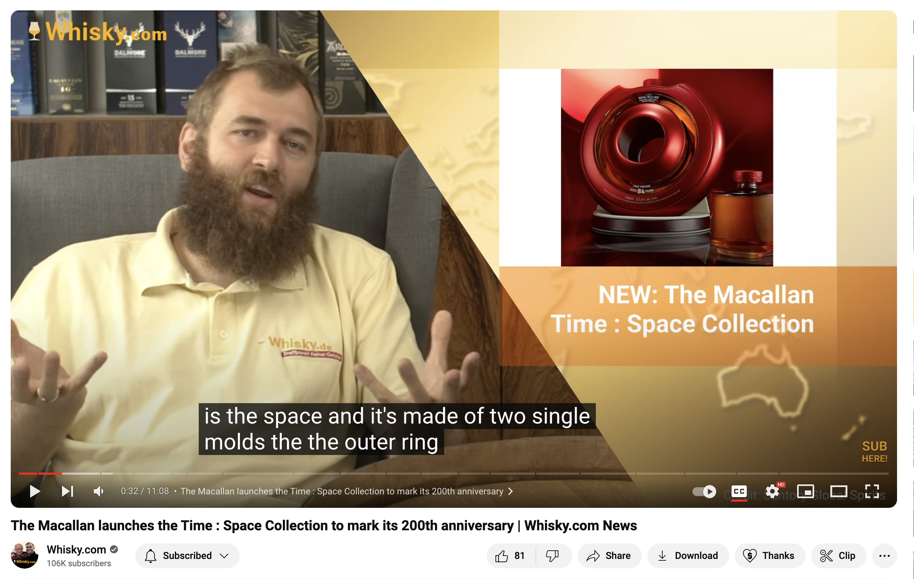
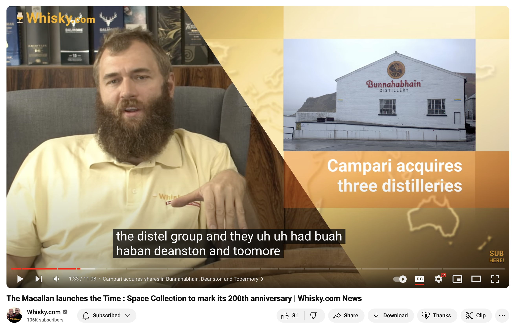
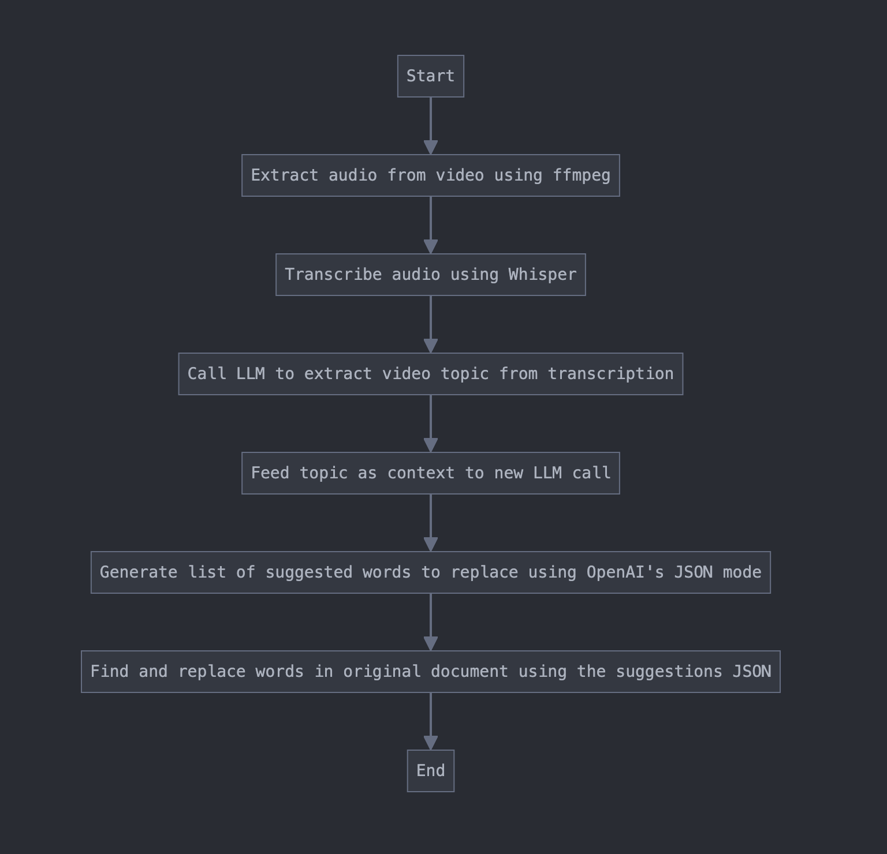

# Improving Whisper Transcriptions with GPT-4o

I was watching the [latest news episode from Whisky.com](https://www.youtube.com/watch?v=rYUOnaPfigg) (where fine spirits meet ™) the other day on YouTube, and noticed that the transcription was really off.

I'm not sure which transcriber is being used by YouTube to generate the closed captions, but it makes a bunch of mistakes, some of which are obviously related to the whisky domain, while others are general transcriptions mistakes.

Using OpenAI's whisper transcriber, results are significantly better, but still, domain-related errors are common. The transcriber is missing important context.

Here are a couple of examples:

## Example 1



**Expected**: "two **single malts**" (single malt is a common whisky term)  
**YouTube transcriber**: "two single molds"  
**OpenAI Whisper**: "two single moulds"

## Example 2



**Expected:** "the Distel Group and they had **Bunnahabhain**, **Deanston** and Tobermory in their group"

**YouTube transcriber**: "the distel group and they uh uh had buah haban deanston and toomore in their group"  
**OpenAI Whisper**: "the Distel Group and they had Bunnehaben, Diensten and Tobermory in their group"

So, while it looks like YouTube could generate some improvements by using a model similar to Whisper (perhaps it's some conscious decision on their end to use a smaller and weaker model due to their scale), there is still much room for improvement on top of Whisper's result as well. 

Unfortunately, the transcription cannot be handed over as-is to something like GPT as it would change the original text such that it does not match the video anymore (using prompt engineering, I could not get the model to avoid changing some pieces of text from the original).

However, we can easily solve this issue almost entirely, by implementing the following pattern to provide context to the transcriber:



Once the audio has been extracted from the video and transcribed with Whisper, we can feed it to an LLM like GPT4-o to extract the topic.

For example, for the above mentioned episode, the topic extract from the transcription was: "The video is a news update from whisky.com, covering various developments and releases in the whisky industry as of September 23, 2024. It includes announcements about new whisky collections, anniversaries, and special editions from well-known distilleries such as Macallan, Glenmorangie, and Johnny Walker, among others. The video also discusses acquisitions in the whisky industry, environmentally friendly packaging innovations, and upcoming live whisky tastings. The news spans regions including Scotland, Ireland, the United States, and Germany, highlighting both new products and industry events."

With this context in hand, we can make yet another call to the LLM, this time with the dynamically-generated context about the video. Using OpenAI's JSON response mode, we can ask the LLM to generate a JSON file with suggestions for replacements based on the original text and the newly learned context.

For example, for the above episode, the JSON looks like so:

```json
{
  "McAllen": "Macallan",
  "moulds": "malts",
  "Bunnehaben": "Bunnahabhain",
  "Diensten": "Deanston",
  "Cape Vinn": "Capevin",
  "Kings Bar & Distillery": "Kingsbarns Distillery",
  "Kings Bar's Coal Town": "Kingsbarns Coal Town",
  "Oktimo": "Octomore",
  "Eila": "Islay",
  "Tom & Tal": "Tomintoul",
  "Schippers Riegel": "Schipper's Riegel",
  "Pungent": "Puncheon",
  "cream sherry": "Cream Sherry",
  "chinkampin": "Chinquapin",
  "Sluers": "Slyrs",
  "Aluvalia": "Aluwalia"
}
```

The whisky geeks amongst you will notice that the suggestions are really spot on for the whisky domain industry.

Finally, we can simply run a find & replace function on the original text using the suggested keywords, to end up with a perfect transcription!

## Implementation

This project is a Python-based implementation of the above that transcribes video files using OpenAI's Whisper model and improves the resulting transcription using OpenAI's GPT-4o model.

### Features

- Extracts audio from video files (ffmpeg required)
- Transcribes audio using OpenAI's Whisper model (OpenAI API key required)
- Improves transcription using GPT-4o (OpenAI API key required)
- Generates suggestions for corrections (OpenAI API key required)
- Applies corrections to the original transcription

### Prerequisites

- Python 3.6+
- FFmpeg (for audio extraction)
- OpenAI API key

### Installation

1. Clone this repository:

```
git clone <repository-url>
cd <repository-directory>
```

2. Install the required packages:

```
pip install -r requirements.txt
```

You also need ffmpeg installed to extract the audio from a video file.

3. Set up your OpenAI API key:

Create a `.env` file in the project root and add your API key:

```
OPENAI_API_KEY=your_api_key_here
```

### Usage

Run the main script with the path to your video file:

```
python main.py <path_to_video_file>
```

The script will:

1. Extract audio from the video
2. Transcribe the audio
3. Improve the transcription
4. Save the improved transcription

### File Structure

- `main.py`: The main script that orchestrates the transcription and improvement process
- `transcriber.py`: Contains the `VideoTranscriber` class for audio extraction and transcription
- `single_shot_fixer.py`: Contains the `TranscriptionImprover` class and related functions for improving transcriptions
- `requirements.txt`: Lists the required Python packages

### Output

The script generates the following files:

- `<video_name>.mp3`: Extracted audio file
- `whisper_subs/transcription.txt`: Original transcription
- `whisper_subs/transcription.suggestions.json`: Suggested improvements
- `whisper_subs/transcription.improved.txt`: Improved transcription

### Error Handling

The script includes error handling and logging. Check the console output for any error messages or the log file if you've set up logging to a file.

### Contributing

Contributions are welcome! Please feel free to submit a Pull Request.

### License

The code in this repo is licensed under MIT. The media in this repo is compiled from screenshots of the Whisky.com YouTube channel and is used for educational purposes only, and is property of Whisky.com.

### Acknowledgements

This project uses the following open-source libraries and APIs:

- OpenAI's GPT-4 and Whisper models
- python-dotenv
- FFmpeg (indirectly)
- [Whisky.com video from YouTube](https://www.youtube.com/watch?v=rYUOnaPfigg) 